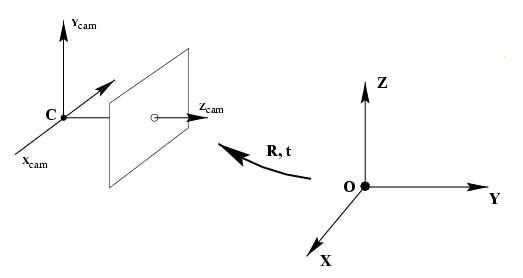
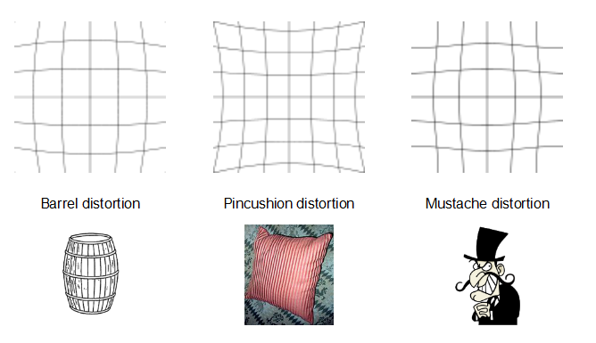

# Camera calibration

**Notes:** Please install [GitHub with MathJax](https://chrome.google.com/webstore/detail/github-with-mathjax/ioemnmodlmafdkllaclgeombjnmnbima) to view LaTex formulation, Thank you.

<!--TOC-->

- [Theory](#Theory)
- [Camera calibration with SIFT detection and match algorithm](#Camera-calibration-with-SIFT-detection-and-match-algorithm)

<!--TOC-->

### **Theory**

- **Definition:** A camera projects 3D world-points onto the 2D image plane.

- **Calibration**: Finding the quantities internal to the camera that affect this imaging process

  - Image center
  - Focal length
  - Lens distortion parameters

- **Basic coordinate**

  - world coordinate
  - camera coordinate 
  - image coordinate
  - plane coordinate (defined by myself for easily explaining)

- **Main procedures**

  - stage 1: from world coordinate to camera coordinate, this is from 3D points to 3D points including $R$ and $t$ etc. parameters. 
  - stage 2: from camera coordinate to image coordinate, this is from 3D to 2D points including $K$ (camera intrinsic) etc. parameters.

- **From world coordinate to camera coordinate**

  - **Coordinate introduction**

  

  From world coordinate to camera coordinate needs two operations: translate and rotation. It can be simply described: firstly, translate the origin of word to the camera coordinate location and then rotate it for aligning the coordinates.
  $$
  \widetilde{X}_{cam} = R(\widetilde{X}-\widetilde{C})
  $$
  Where,

  ​	$R$ rotation matrix

   	$\widetilde{X}$ and $\widetilde{C}$ is the location in the world coordinate respectively

  ​	$\widetilde{X}_{cam}$  is the location in the camera coordinate

  - **From world coordinate to camera coordinate**

  

  We set $R=R_x(\psi)R_y(\varphi)R_z(\theta)$ therefore,
  $$
  X_{cam}=\left( \begin{array}{ccc}X_{cam}\\\\1\end{array}\right)=\left[\begin{array}{ccc}R&−R\widetilde{C}\\\\0&1\end{array}\right]\left( \begin{array}{ccc}\widetilde{X}\\\\1\end{array}\right)=\left[\begin{array}{ccc}R&−R\widetilde{C}\\\\0&1\end{array}\right]X
  $$
  Where we also can say $t=R\widetilde{C}$ and the $X$ we will discuss later.

- **From camera coordinate to image coordinate**

  - **Coordinate introduction**

  

  Where, 

  $C$ is camera center

  $Z$ is principal axis

  The plane of $p$ is image plane, it is a 2D plane

  $p$ is principal point

  $f$ is focal length, the distance between $C$ and $p$

  The plane coordinate $xpy$ is paralleled with the camera coordinate $XCY$ and  the measure value is $metre(m)$

  The image coordinate usually said the relative coordinate to plane coordinate, its origins is in the left-bottom corner, measured by the numbers of $pixel$

  - **From camera coordinate to plane coordinate**

  Given $X$ in the our real world, the corresponding point in the camera coordinate is $x$. Requirement from $X(X,Y,Z)$ to $x(x,y)$. Note: $(X,Y,Z)$ is in the camera coordinate and $(x,y)$ is in the plane coordinate (different with image coordinate, the origins is different). We can get:
  $$
  x=f\cdot\frac{X}{Z} \\
  y=f\cdot\frac{Y}{Z} \\
  (X,Y,Z)↦(f\cdot\frac{X}{Z},f\cdot\frac{Y}{Z})
  $$
  In matrix, 
  $$
  \left(\begin{array}{ccc}X\\\\Y\\\\Z\\\\1\end{array}\right)↦
  \left(\begin{array}{ccc}f\cdot{X}\\\\f\cdot{Y}\\\\Z\end{array}\right)=
  \left[\begin{array}{ccc}f & 0 & 0 & 0 \\\\ 0 & f & 0 & 0\\\\0&0&1&0\end{array}\right]
  \left(\begin{array}{ccc}X\\\\Y\\\\Z\\\\1\end{array}\right)
  $$
  Abbreviation, $P$ is the projection matrix but not complete now.
  $$
  x=PX
  $$

  - **Adding offset**

  We have converted object point from camera coordinate to plane coordinate, but our target is get the image coordinate.

   

  We know, $p$ is the origin of plane coordinate but it is $(p_x,p_y)$ in the image coordinate.
  $$
  (X,Y,Z)↦(f\cdot\frac{X}{Z}+p_x,f\cdot\frac{Y}{Z}+p_y)
  $$
  Matrix, (can divided by $Z$)
  $$
  \left(\begin{array}{ccc}X\\\\Y\\\\Z\\\\1\end{array}\right)↦
  \left(\begin{array}{ccc}f\cdot{X}+Zp_x\\\\f\cdot{Y}+Zp_y\\\\Z\end{array}\right)=
  \left[\begin{array}{ccc}f & 0 & p_x & 0 \\\\ 0 & f & p_y & 0\\\\0&0&1&0\end{array}\right]
  \left(\begin{array}{ccc}X\\\\Y\\\\Z\\\\1\end{array}\right)
  $$
  Therefore,
  $$
  \left(\begin{array}{ccc}fX+Zp_x\\\\fY+Zp_y\\\\Z\end{array}\right)=
  \left[\begin{array}{ccc}f & 0 & p_x \\\\ 0 & f & p_y \\\\0&0&1\end{array}\right]
  \left[\begin{array}{ccc}1 & 0 & 0&0 \\\\ 0 & 1 & 0 &0\\\\0&0&1&0\end{array}\right]
  \left(\begin{array}{ccc}X\\\\Y\\\\Z\\\\1\end{array}\right)
  $$
  Here, **$K$ named intrinsic parameters** is defined by
  $$
  K=\left[\begin{array}{ccc}f & 0 & p_x \\\\ 0 & f & p_y \\\\0&0&1\end{array}\right]
  $$
  And $P$, we can assume the rotation matrix $R$ is $I$, and the translate matrix $t$ is  $0$
  $$
  P=K*[I|0]
  $$

  - **From plane coordinate to image coordinate**

  $$
  x=K[I|0]X_{cam}=K[R|-R\widetilde{C}]X
  $$

  The final $p$ is
  $$
  P=K[R|t]
  $$
  Where **$R, t$ is named the camera extrinsic parameters**.  

  - Convert the image coordinate by pixel

  In the image coordinate, it usually use the ***pixel*** to measure  not ***m***. So, we need another step. We set 

  $m_{x}$ is the numbers of pixel of $1m$ in the horizontal and,

  $m_{y}$ denotes the numbers of pixels of $1m$ in the 

  Thus, we can get the area of one pixel ($m^2$),
  $$
  \frac{1}{m_{x}}\times\frac{1}{m_y}
  $$
  The pixel can be not the square, it also can be rectangle. We update $K$
  $$
  K=\left[\begin{array}{ccc}m_{x} & 0 & 0 \\\\ 0 & m_{y} & 0 \\\\0&0&1\end{array}\right]
  \left[\begin{array}{ccc}f & 0 & p_x \\\\ 0 & f & p_y \\\\0&0&1\end{array}\right]=
  \left[\begin{array}{ccc}f_{x} & 0 & c_x \\\\ 0 & f_{y} & c_y \\\\0&0&1\end{array}\right]
  $$
  Generally, when we use camera intrinsic parameters $K$ to calculate, the provided parameters is converted values, e.g. it will provide $f_{x},f_{y},c_{x},c_{y}$.

  - **Summary**

  The final formulation is,
  $$
  \left(\begin{array}{ccc}xZ\\\\yZ\\\\Z\end{array}\right)=
  \left[\begin{array}{ccc}f_{x} & 0 & c_x \\\\ 0 & f_{y} & c_y \\\\0&0&1\end{array}\right]
  [R_{3x3}|t_{3x1}]
  \left(\begin{array}{ccc}X\\\\Y\\\\Z\\\\1\end{array}\right)
  $$
  Thus, we can get $x(x,y)$
  $$
  \left(\begin{array}{ccc}xZ\\\\yZ\\\\Z\end{array}\right)\frac{1}{Z}↦
  \left(\begin{array}{ccc}x\\\\y\\\\1\end{array}\right)
  $$

- **Considering Distortion Parameters**

  The distortion Parameters includes `Radial distortion` and `tangential distortion`

  - **Radial distortion** includes barrel distortion, pincushion distortion and mustache distortion.

    

    It can be corrected by
    $$
    x_{corr}=x_{dis}(1+k_{1}r^2+k_{2}r^4+k_{3}r^6)\\
    y_{corr}=y_{dis}(1+k_{1}r^2+k_{2}r^4+k_{3}r^6)
    $$

  - **tangential distortion** 

  

  It can be corrected by
  $$
  x_{corr}=x_{dis}+[2p_{1}xy+p_{2}(r^2+2x^2)]\\
  y_{corr}=y_{dis}+[p_{1}(r^2+2y^2)+2p_{2}xy]
  $$
  Where,

  $x_{dis},y_{dis}$ represent the distorted coordinate

  $x_{corr},y_{corr}$ represent the corrected coordinate

  $k_{1},k_{2},k_{3}$ is the  radial distortion parameters

  $p_{1},p_{2}$ is the tangential distortion parameters

  Therefore, we get 5 distortion parameters
  $$
  D=(k_{1},k_{2},p_{1},p_{2},k_{3})
  $$

- 

### Camera calibration with SIFT detection and match algorithm

- Main steps: (***see scripts for more information and feel free to modify***)

  - Use your camera or phone take several pictures (at least 4), put in the ***chessboards_imgs*** directory

  - Run *detect_keypoints_sift.py* for each pattern images in chessboards_imgs directory to get related ***keypoints and descriptors***. For example:

    ```shell
    python detect_keypoints_sift.py --in_fname ./chessboards_imgs/left01.jpg --out_fname keypoints_dir/left01.txt
    ```

    

  - Run *sift_match.py* for each pattern images in chessboards_imgs directory to get related ***keypoints and descriptors***. For example:

    ```shell
     python match_keypoints.py --in_fname_1 ./chessboards_imgs/left01.jpg --in_fname_2 ./chessboards_imgs/left01.jpg --out_fname match_left01_to_left02.txt
    ```

  - Run *calibrate_intrinsics.py* to calculate **camera intrinsics**. 

    ```shell
    python calibrate_intrinsics.py --pattern_key_fname keypoints_dir/left01.txt --img_keypoints_root ./keypoints_dir/ --select_match_keypoints_root ./select_match_keypoints_dir/ --example_image ./meilan_note6_resized/note01.jpg
    ```

    *Notes: need to adjust related parameters to get a better result.*


[TODO] Implement the function *calibrateCamera*.


If you have any question or find any problems, please contact me or issue.


- References:
  - <https://blog.csdn.net/Peng___Peng/article/details/51725219>
  - <https://blog.csdn.net/honyniu/article/details/51004397>
  - <https://blog.csdn.net/mightbxg/article/details/79363699>
  - https://github.com/ksimek/sift_calibration

